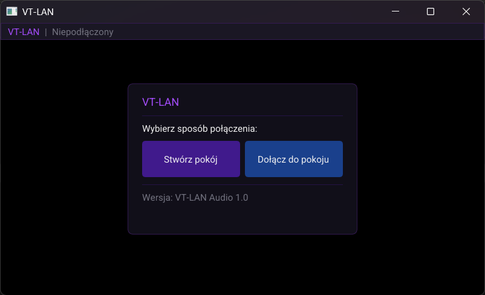
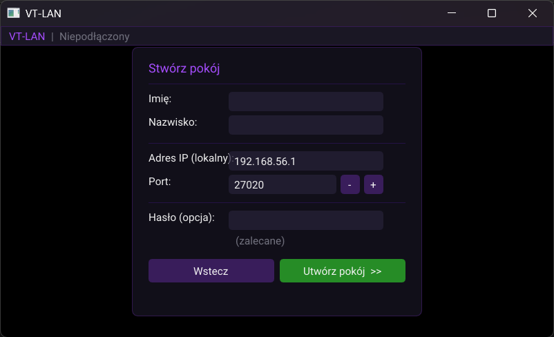
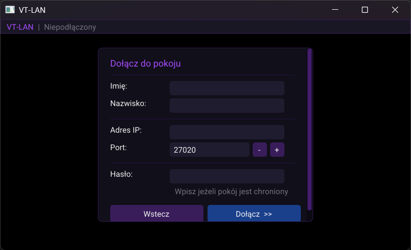
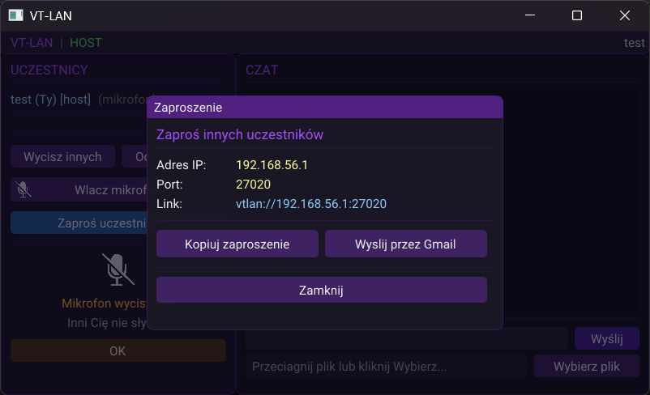
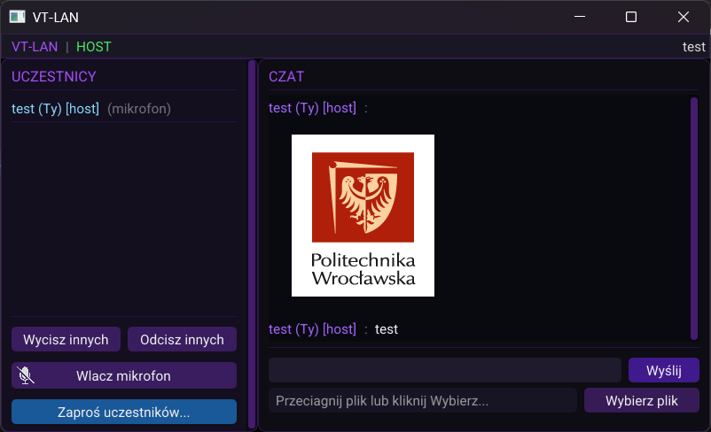

# VT-LAN — Instrukcja obsługi

VT-LAN to aplikacja do komunikacji głosowej i przesyłania plików w sieci lokalnej (LAN). Połączenie z internetem nie jest wymagane — wystarczy, że wszystkie urządzenia są podłączone do tej samej sieci Wi-Fi lub Ethernet.

---

## Spis treści

1. [Pobieranie i instalacja](#1-pobieranie-i-instalacja)
2. [Pierwsze uruchomienie](#2-pierwsze-uruchomienie)
3. [Tworzenie pokoju (Host)](#3-tworzenie-pokoju-host)
4. [Dołączanie do pokoju (Klient)](#4-dołączanie-do-pokoju-klient)
5. [Zapraszanie uczestników](#5-zapraszanie-uczestników)
6. [Pokój rozmów — obsługa aplikacji](#6-pokój-rozmów--obsługa-aplikacji)
7. [FAQ — Często zadawane pytania](#7-faq--często-zadawane-pytania)
8. [Rozwiązywanie problemów](#8-rozwiązywanie-problemów)

---

## 1. Pobieranie i instalacja

### Krok 1 — Pobierz aplikację

Należy przejść do zakładki **Releases** na stronie projektu i pobrać najnowszą wersję aplikacji (plik `.zip`).

### Krok 2 — Wypakuj archiwum

Po pobraniu pliku `.zip`:

1. Kliknij **prawym przyciskiem myszy** na pobrany plik.
2. Wybierz **„Wyodrębnij wszystko…"** (lub „Wypakuj tutaj").
3. Wskaż folder docelowy.
4. Otwórz wypakowany folder i uruchom plik **`VT-LAN.exe`**.

> **Uwaga:** Aplikacji nie należy uruchamiać bezpośrednio z archiwum ZIP — wymagane jest wcześniejsze wypakowanie zawartości.

---

## 2. Pierwsze uruchomienie

Po uruchomieniu aplikacji wyświetlany jest ekran startowy:

Na tym ekranie dostępne są dwie opcje:

- **Utwórz pokój** — pozwala uruchomić sesję jako host i oczekiwać na połączenia od innych uczestników.
- **Dołącz do pokoju** — umożliwia przyłączenie się do istniejącej sesji utworzonej przez innego użytkownika.

> **Informacja:** Dane takie jak imię i nazwisko są przechowywane lokalnie. Przy kolejnym uruchomieniu aplikacji pola te zostaną wypełnione automatycznie.

---

## 3. Tworzenie pokoju (Host)

Aby zaprosić innych uczestników do rozmowy, należy wybrać opcję **„Utwórz pokój"**.

Formularz zawiera następujące pola:

| Pole | Opis |
|------|------|
| **Imię** | Imię widoczne dla pozostałych uczestników |
| **Nazwisko** | Nazwisko widoczne dla pozostałych uczestników |
| **Port** | Numer portu używanego do połączenia. Domyślna wartość nie wymaga zmiany w typowych warunkach |
| **Hasło** *(opcjonalne)* | Ogranicza dostęp do pokoju — tylko osoby znające hasło będą mogły dołączyć. Pozostawienie pola pustego oznacza brak zabezpieczenia hasłem |

**Adres IP** pobierany jest automatycznie na podstawie adresu urządzenia w sieci lokalnej — nie wymaga ręcznego uzupełnienia.

Po wypełnieniu formularza należy kliknąć przycisk **„Utwórz"**, aby uruchomić pokój i przejść do ekranu zaproszenia.

---

## 4. Dołączanie do pokoju (Klient)

Aby dołączyć do istniejącej sesji, należy wybrać opcję **„Dołącz do pokoju"**.

Formularz zawiera następujące pola:

| Pole | Opis |
|------|------|
| **Imię** | Imię widoczne dla pozostałych uczestników |
| **Nazwisko** | Nazwisko widoczne dla pozostałych uczestników |
| **Adres IP hosta** | Adres IP urządzenia hosta — dostępny w otrzymanym zaproszeniu |
| **Port** | Numer portu podany przez hosta — dostępny w otrzymanym zaproszeniu |
| **Hasło** *(jeśli wymagane)* | Wymagane wyłącznie w przypadku, gdy host zabezpieczył pokój hasłem |

Po wypełnieniu formularza należy kliknąć przycisk **„Dołącz"**, aby nawiązać połączenie.

---

## 5. Zapraszanie uczestników

Po utworzeniu pokoju wyświetlany jest ekran z opcjami zaproszenia:

Dostępne są następujące metody zaproszenia uczestników:

- **Kopiuj zaproszenie do schowka** — kliknięcie przycisku kopiuje gotowe zaproszenie zawierające adres IP, port oraz link do pokoju. Skopiowaną treść należy wkleić (**Ctrl+V**) w wybranym komunikatorze lub wiadomości e-mail i przesłać zapraszanej osobie.
- **Zaproszenie przez Gmail** *(opcjonalne)* — umożliwia wysłanie zaproszenia bezpośrednio z konta Gmail. Należy postępować zgodnie z instrukcją wyświetlaną na ekranie.

> **Ważne:** Zaproszenie jest ważne wyłącznie w obrębie tej samej sieci lokalnej. Zapraszany uczestnik musi być podłączony do **tej samej sieci Wi-Fi lub LAN co host**.

---

## 6. Pokój rozmów — obsługa aplikacji

Po dołączeniu do pokoju wyświetlany jest główny ekran aplikacji:

### Lista uczestników

Po jednej ze stron ekranu widoczna jest lista wszystkich aktualnie połączonych uczestników wraz z ich imionami i nazwiskami.

### Mikrofon — wyciszanie i odciszanie

Przycisk z ikoną mikrofonu służy do **wyciszania i odciszania** mikrofonu:

- Pierwsze kliknięcie **wycisza** mikrofon — pozostali uczestnicy przestają słyszeć nadajnik.
- Ponowne kliknięcie **odcisza** mikrofon.

Wyciszenie mikrofonu nie przerywa połączenia — dźwięk od pozostałych uczestników jest nadal odbierany.

### Wysyłanie plików

Aplikacja obsługuje dwa sposoby wysyłania plików do uczestników pokoju:

**Metoda 1 — Przeciągnij i upuść (drag & drop)**
1. Otwórz folder z plikiem przeznaczonym do wysłania.
2. Chwyć plik i przeciągnij go na okno aplikacji, przytrzymując lewy przycisk myszy.
3. Zwolnienie przycisku myszy inicjuje wysyłanie pliku.

**Metoda 2 — Wybór pliku z dysku**
1. Kliknij ikonę lub przycisk wyboru pliku w interfejsie aplikacji.
2. W oknie dialogowym przejdź do docelowego pliku i kliknij go dwukrotnie lub zaznacz i wybierz „Otwórz".
3. Plik zostanie wysłany do uczestników pokoju.

> Odebrane pliki zapisywane są automatycznie w folderze **`received_files`** w katalogu aplikacji.

---

## 7. FAQ — Często zadawane pytania

**Czy aplikacja działa przez internet?**
Nie. VT-LAN działa wyłącznie w sieci lokalnej (LAN/Wi-Fi). Wszystkie urządzenia muszą być podłączone do tej samej sieci.

**Czy wymagana jest instalacja dodatkowego oprogramowania?**
Nie — wystarczy wypakować archiwum ZIP i uruchomić plik `.exe`. Instalacja dodatkowych komponentów nie jest wymagana.

**Ile urządzeń może jednocześnie uczestniczyć w pokoju?**
Aplikacja obsługuje wiele urządzeń równocześnie — nie obowiązuje stały limit uczestników.

**Czy dane osobowe (imię, nazwisko) są przesyłane poza sieć lokalną?**
Nie. Dane przechowywane są wyłącznie lokalnie na urządzeniu użytkownika i nie opuszczają sieci lokalnej.

**Gdzie zapisywane są odebrane pliki?**
Pliki odebrane w pokoju są zapisywane w folderze **`received_files`** w katalogu aplikacji.

**Hasło do pokoju jest nieznane — jak postąpić?**
Hasło znane jest wyłącznie hostowi, który je ustawił. Należy skontaktować się z tą osobą w celu jego uzyskania.

**Aplikacja prosi o zezwolenie na dostęp do sieci — co wybrać?**
Należy kliknąć **„Zezwól"**. Jest to standardowy komunikat systemu Windows wymagany do prawidłowego działania aplikacji w sieci lokalnej.

---

## 8. Rozwiązywanie problemów

### Aplikacja nie uruchamia się lub wyświetla błąd przy starcie

#### a) Sprawdzenie obsługi Vulkan i sterowników karty graficznej

Aplikacja wymaga karty graficznej zgodnej z technologią **Vulkan**. W przypadku problemów z uruchomieniem:

1. Należy zainstalować **aktualne sterowniki karty graficznej**.
   - **NVIDIA:** [nvidia.com/drivers](https://www.nvidia.com/Download/index.aspx)
   - **AMD:** [amd.com/support](https://www.amd.com/en/support)
   - **Intel (grafika zintegrowana):** [intel.com/download-center](https://www.intel.com/content/www/us/en/download-center/home.html)
2. Po zainstalowaniu sterowników należy **uruchomić komputer ponownie** i powtórzyć próbę.

> Starsze karty graficzne mogą nie obsługiwać technologii Vulkan — w takim przypadku uruchomienie aplikacji na danym urządzeniu może nie być możliwe.

#### b) Weryfikacja sposobu uruchomienia

Należy upewnić się, że plik `.exe` jest uruchamiany z **wypakowanego folderu**, a nie bezpośrednio z archiwum ZIP.

---

### Brak możliwości połączenia z pokojem

#### a) Typ sieci w systemie Windows

System Windows rozróżnia sieci „Prywatne" i „Publiczne". Sieć publiczna może blokować część połączeń lokalnych.

1. Należy otworzyć **Ustawienia** (klawisz Windows + I).
2. Przejść do sekcji **Sieć i Internet**.
3. Kliknąć aktywną sieć Wi-Fi lub Ethernet.
4. Upewnić się, że typ sieci jest ustawiony na **„Prywatna"**.
5. W przypadku ustawienia „Publiczna" należy zmienić je na „Prywatna" i ponowić próbę połączenia.

#### b) Konfiguracja ruchu UDP w sieci

Aplikacja komunikuje się przez protokół **UDP**. Domyślny port to **27020** — host może jednak wybrać dowolny inny port w formularzu tworzenia pokoju. W sieciach z aktywną polityką firewall konieczne może być ręczne zezwolenie na ruch UDP na używanym porcie.

**Na urządzeniu hosta (Zapora Windows Defender)**

Przy pierwszym uruchomieniu system Windows może wyświetlić prośbę o zezwolenie na dostęp do sieci — należy kliknąć **„Zezwól"**. Jeśli komunikat nie pojawił się, należy ręcznie dodać regułę:

1. Otworzyć **Zaporę Windows Defender z zabezpieczeniami zaawansowanymi** (wyszukać w menu Start).
2. Wybrać **Reguły przychodzące** → **Nowa reguła**.
3. Wybrać typ reguły: **Port**.
4. Wybrać protokół **UDP** i wpisać numer portu (domyślnie **27020**).
5. Wybrać **Zezwalaj na połączenie** i zatwierdzić regułę.

**Dla administratora sieci firmowej**

W przypadku zarządzanej infrastruktury sieciowej (firewall sprzętowy, polityki VLAN) administrator powinien zezwolić na ruch **UDP** na porcie używanym przez hosta (domyślnie **27020**) w obrębie sieci lokalnej. Wymagane jest zezwolenie zarówno na ruch przychodzący, jak i wychodzący na urządzeniu hosta. Przykładowa reguła dla typowych rozwiązań:

| Parametr | Wartość |
|----------|---------|
| Protokół | UDP |
| Port docelowy | 27020 *(lub port skonfigurowany przez hosta)* |
| Kierunek | Inbound + Outbound |
| Zakres | Sieć lokalna (LAN) |
| Akcja | Zezwól (Allow) |

Jeśli sieć korzysta z izolacji klientów Wi-Fi (**client isolation**), funkcja ta musi być wyłączona dla segmentu, w którym pracuje aplikacja — izolacja klientów uniemożliwia bezpośrednią komunikację między urządzeniami w tej samej sieci.

#### c) Wspólna sieć lokalna

Host i wszyscy klienci muszą być podłączeni do **tej samej sieci Wi-Fi lub LAN**. Połączenie między urządzeniem w sieci domowej a urządzeniem korzystającym z mobilnej transmisji danych (LTE/5G) nie jest obsługiwane.

---

W razie dalszych problemów należy zgłosić je w zakładce **Issues** na stronie projektu.
